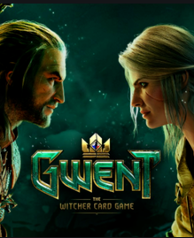
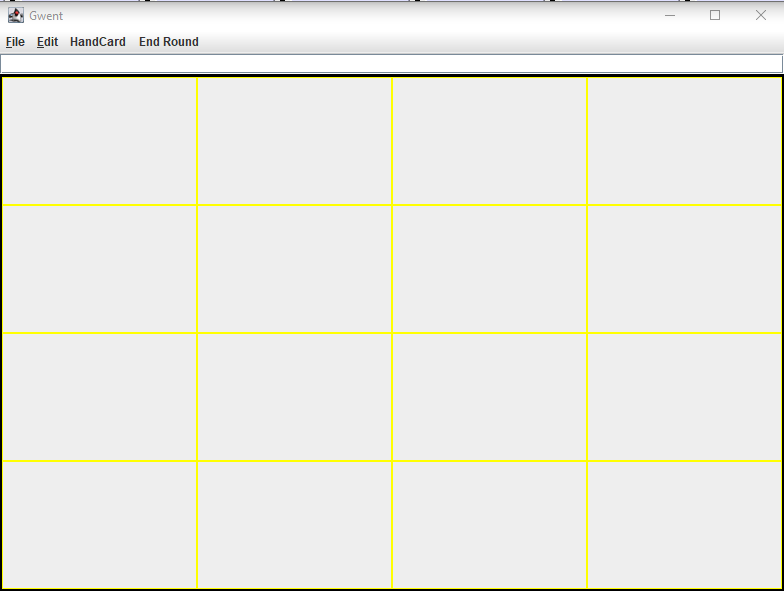
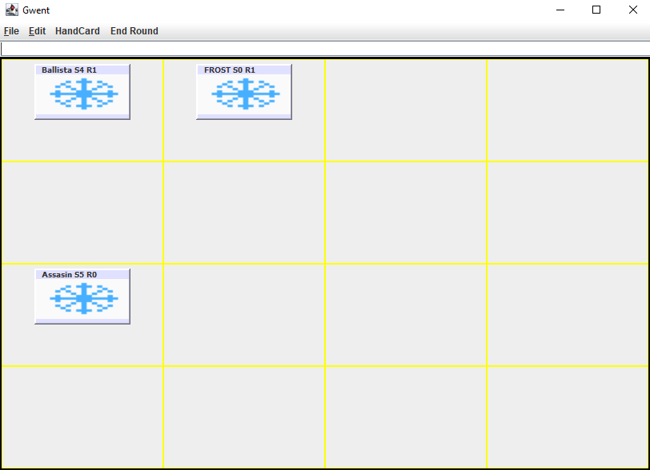
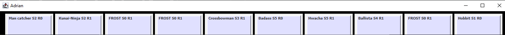
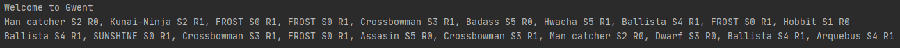
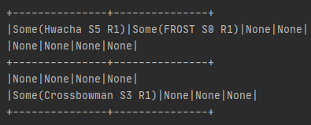

  
 
# GWENT
Project for a Software Engineering class

A simplified version of the card game Gwent from the rpg The Witcher 3

#How the Game works

* Both players get 10 random Cards in their hands
* Players DON'T get new Cards in new rounds
* Cards have a strength value and a range value
* The players alternate their turns
* Cards can ONLY be laid in their respective range (row)
* There exist 3 weather Cards and a Hobbit:
    - Sunshine sets all Cards on their regular strength value
    - Frost sets ALL melee Cards to 0 strength
    - Fog sets ALL ranged Cards to 0 strength
    - The Hobbit brings Sunshine to all Cards
 * Only a single weather Card is active at a time
 * The current player can pass any time
 * The round ends when both players pass
 * When the round ends, the player with the highest sum of strentgth values wins
 * The first Player to win 2 rounds, wins the game      
 
 

 
 #GUI
 * The playing field is a 4x4 grid
 * The Topside and first player plays on the upper two rows and the second player on the bottom two
 * Cards with a range of 1 can only be played in the outer rows of the field, range 0 on the inner rows
  
  
 * The players Cards are automatically opened in a new window when their turn starts
 * If you close your Card window you can always reopen it with the "Handcard" Menu on the field
  
 
  #TUI
  * When starting up the game the players are greeted and both their Cards are printed out
  * With each turn a new updated textgrid is shown
  * The TUI Controls are: 
          -c => pass this Round 
          -z => undo 
          -r => redo 
          -row column Index => Play the indexed card in row/column 
   
  
     
